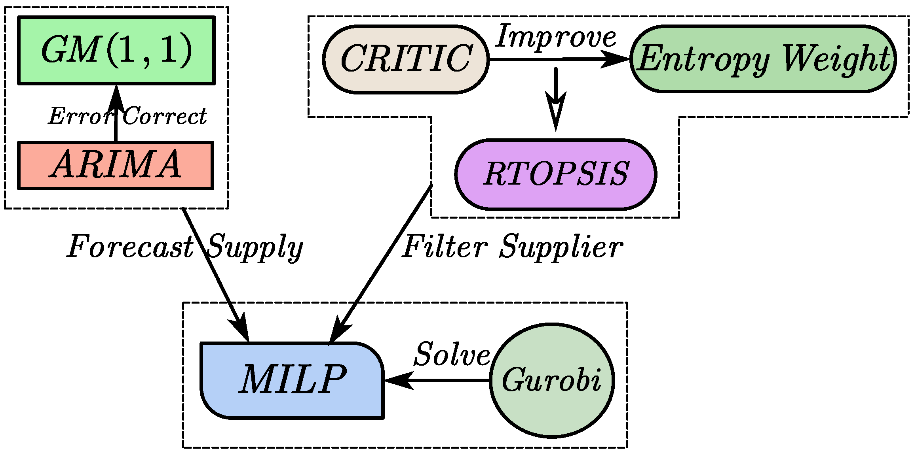

# DE-MOOT: Research on Data-driven Enterprise Raw Material Ordering and Optimal Transportation Scheme
Repository for our published paper [Research on Data-driven Enterprise Raw Material Ordering and Optimal Transportation Scheme](https://ieeexplore.ieee.org/abstract/document/9852530/)
## Abstract
Ordering and transportation optimization of raw material is a classic problem in the field of optimization. Based on the analysis, evaluation and prediction of previous data, this paper fully considers the actual situation of ordering, transshipment and storage, and establishes a multistage and large-scale mixed integer linear programming model for ordering and transporting raw materials. Combined with extensive data background, select appropriate indicators, and establish supplier evaluation systems by using entropy weight-CRITIC and RTOPSIS method. GM (1,1) is used to predict the general trend, the ARIMA model is used to predict the random fluctuation items, and a grey time series prediction model is constructed to obtain the predicted values of the data of the supply and loss rate in the next cycle. The prediction result are introduced into the planning model as parameters, and the evaluation score are used to construct a satisfaction function. The final goal of mixed integer linear programming model, as well as the three goals of sorting, transferring and storing, are obtained by reduction process. Finally, this paper uses Gurobi to solve practical problems, and obtains the ordering scheme and transshipment scheme that are superior to the historical schemes in ordering cost, transshipment loss and storage cost.



## Enviroment
```
python 3.9.12
Gurobi 10.0.0 (download: https://www.gurobi.com/downloads/gurobi-software/
license: https://www.gurobi.com/downloads/free-academic-license/)
SciencePlots:[detail](https://github.com/garrettj403/SciencePlots)
numpy pandas sympy statsmodels matplotlib
```

## Note
The running results of this repository code are updated compared to the paper results. 
Please understand if there are any discrepancies.

## Citation
If our work help to your research, please cite our paper, thx.
```
@INPROCEEDINGS{9852530,
    author={Mi, Kerun and Gu, Hai and Liu, Jiacheng and Yang, Liu},
    booktitle={2022 Asia Conference on Algorithms, Computing and Machine Learning (CACML)},
    title={Research on Data-driven Enterprise Raw Material Ordering and Optimal Transportation Scheme},
    year={2022},
    volume={},
    number={},
    pages={653-658},
    doi={10.1109/CACML55074.2022.00114}}
```
